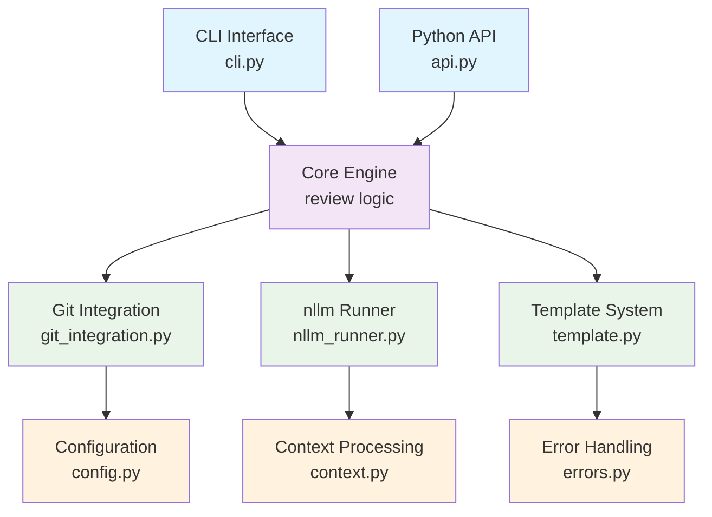
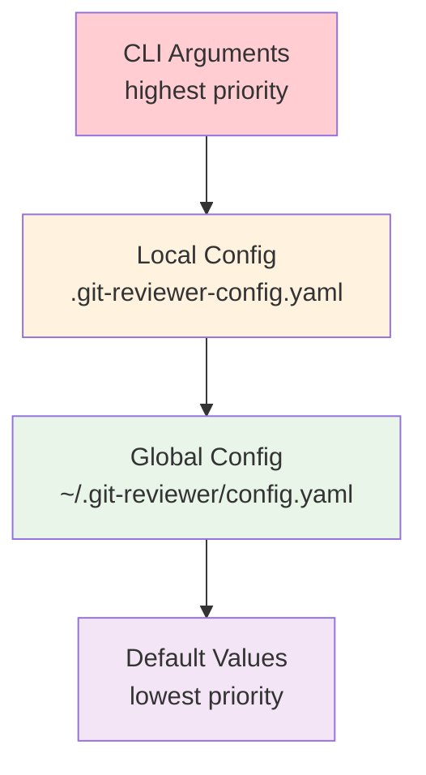
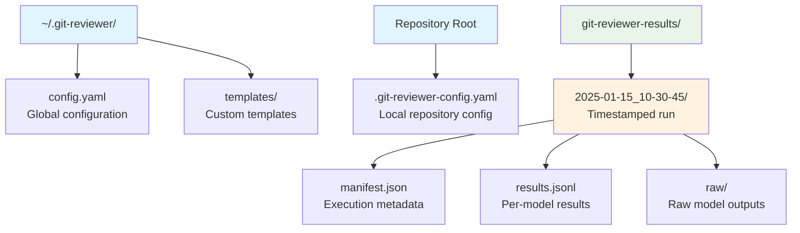

# git-reviewer Architecture

## Overview

git-reviewer is an AI-powered code review tool that analyzes git changes using multiple Large Language Models (LLMs) simultaneously. It follows a layered architecture with clear separation of concerns and pluggable components.

## System Architecture

## Core Components

### 1. Interface Layer

#### CLI Interface (`cli.py`)
- **Purpose**: Command-line interface using Typer framework
- **Responsibilities**:
  - Argument parsing and validation
  - User interaction and feedback (Rich console output)
  - Error handling and exit codes
  - Configuration discovery
- **Key Features**:
  - Multiple commands: `review`, `init-config`, `check`
  - Rich terminal output with progress indicators
  - Verbose mode for debugging
  - Context-aware help and validation

#### Python API (`api.py`)
- **Purpose**: Programmatic interface for integration
- **Responsibilities**:
  - Simplified function-based API
  - Parameter validation and defaults
  - Return standardized results
- **Key Functions**:
  - `review_repository()`: Main review function
  - `check_configuration()`: Validate setup
  - `get_config_info()`: Configuration inspection
  - `create_config()`: Configuration generation

### 2. Core Engine

The core engine coordinates all review operations through a single entry point that orchestrates:

1. **Configuration Loading**: Merge global/local configs with CLI overrides
2. **Repository Validation**: Ensure valid git repo and prepare workspace
3. **Diff Generation**: Extract changes between branches with context
4. **Context Processing**: Include additional files and repository metadata
5. **Template Population**: Fill review template with diff and context
6. **AI Execution**: Run multiple models via nllm
7. **Result Processing**: Format and return structured results

### 3. Data Processing Components

#### Git Integration (`git_integration.py`)
- **Purpose**: All git-related operations
- **Capabilities**:
  - Repository validation and preparation
  - Diff generation with configurable context
  - Commit information extraction
  - Branch validation and merge-base calculation
- **Features**:
  - Support for different diff scopes (all changes vs committed only)
  - Configurable context lines
  - Handles binary files and renames
  - Statistics collection (files, insertions, deletions)

#### Context Processing (`context.py`)
- **Purpose**: Process additional context files
- **Responsibilities**:
  - Resolve file paths (glob patterns, relative paths)
  - Read and validate context files
  - Generate context summaries
  - Handle encoding and binary files
- **Features**:
  - Supports glob patterns for file selection
  - Size limits and binary file detection
  - Error handling for missing/unreadable files
  - Context summary with statistics

#### Template System (`template.py`)
- **Purpose**: Review template processing
- **Features**:
  - YAML-based template format
  - Variable substitution (`$repo_context`, `$diff`)
  - System and prompt sections
  - Template validation and error handling

### 4. AI Integration

#### nllm Runner (`nllm_runner.py`)
- **Purpose**: Interface to nllm library for multi-model execution
- **Responsibilities**:
  - Model configuration processing
  - Parallel AI model execution
  - Result aggregation and error handling
- **Key Features**:
  - Converts git-reviewer model config to nllm format
  - Handles model options and parameters
  - Returns raw nllm results for maximum flexibility
  - Timeout and retry handling via nllm

### 5. Support Systems

#### Configuration Management (`config.py`)
- **Purpose**: Hierarchical configuration system
- **Features**:
  - YAML-based configuration files
  - Global (`~/.git-reviewer/config.yaml`) and local (`.git-reviewer-config.yaml`) configs
  - CLI argument overrides
  - Configuration validation and defaults
  - Model configuration with per-model options

#### Error Handling (`errors.py`)
- **Purpose**: Centralized error management
- **Error Types**:
  - `GitReviewerError`: Base exception
  - `GitRepositoryError`: Git-related errors
  - `ConfigurationError`: Configuration issues
  - `NLLMError`: AI execution errors

#### Data Models (`models.py`)
- **Purpose**: Type definitions and data structures
- **Models**:
  - `GitInfo`: Git repository metadata
  - `ContextSummary`: Context processing results
  - `ReviewResult`: API return structure (legacy compatibility)

## Data Flow

### Typical Review Flow

### Configuration Hierarchy

## Design Principles

### 1. Modularity
- Each component has a single responsibility
- Clear interfaces between components
- Pluggable architecture for future extensibility

### 2. Configuration-Driven
- Behavior controlled through configuration
- Sensible defaults with override capability
- Environment-specific customization

### 3. Error Resilience
- Graceful handling of missing dependencies
- Clear error messages with actionable guidance
- Partial success handling (some models fail)

### 4. Performance
- Parallel model execution via nllm
- Efficient diff processing
- Streaming output where possible

### 5. Extensibility
- Template-based review system
- Model-agnostic AI integration
- Plugin-ready architecture

## Integration Points

### External Dependencies

- **nllm**: Multi-model AI execution
- **llm**: Underlying model interface
- **git**: Repository operations
- **typer**: CLI framework
- **rich**: Terminal output
- **pyyaml**: Configuration parsing

### File System Layout

## Security Considerations

### Data Handling
- No persistent storage of code content
- Temporary files cleaned up automatically
- No logging of sensitive repository content

### AI Integration
- Model execution through isolated nllm processes
- No direct API key handling (delegated to llm)
- Configurable timeouts and retries

### Configuration
- Configuration files use safe YAML parsing
- No arbitrary code execution in configs
- Validation of all configuration values

## Future Extensions

### Planned Enhancements
1. **Custom Templates**: User-defined review templates
2. **Plugin System**: Custom processors and output formats
3. **Caching**: Diff and context caching for repeated runs
4. **Integration**: GitHub/GitLab PR integration
5. **Metrics**: Performance and usage analytics

### Architecture Flexibility
The current architecture supports these extensions through:
- Template system extensibility
- Modular component design
- Configuration-driven behavior
- Clear separation of concerns