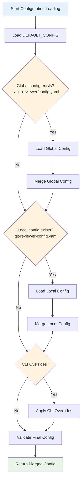

# Configuration System Design

## Overview

git-reviewer uses a hierarchical YAML-based configuration system that allows users to customize behavior at multiple levels. The system prioritizes flexibility while maintaining sensible defaults.

## Configuration Hierarchy

The configuration system follows a clear precedence order (highest to lowest priority):

1. **CLI Arguments** - Runtime overrides
2. **Local Config** - Repository-specific (`.git-reviewer-config.yaml`)
3. **Global Config** - User-specific (`~/.git-reviewer/config.yaml`)
4. **Built-in Defaults** - Fallback values

## Configuration Schema

### Top-Level Structure

```yaml
# Complete configuration example
models:
  - name: gpt-4
    options: ["-o", "temperature", "0.1"]
  - name: claude-3-sonnet
    options: ["-o", "temperature", "0.0", "--system", "You are a code reviewer"]

defaults:
  timeout: 120
  retries: 1
  outdir: ~/code-reviews

git:
  context_lines: 3
  base_branch: main
  diff_scope: all

paths:
  template: review.template.yml
```

### Configuration Sections

#### `models` (required)
Defines the AI models to use for reviews.

```yaml
models:
  - name: "model-identifier"    # Model name as recognized by llm
    options: [...]              # List of options to pass to llm
```

**Model Options Format:**
- Follow llm CLI option format
- Use array format: `["-o", "key", "value"]`
- Common options:
  - Temperature: `["-o", "temperature", "0.1"]`
  - System prompt: `["--system", "Custom instructions"]`
  - Max tokens: `["-o", "max_tokens", "4000"]`

#### `defaults`
General execution settings.

```yaml
defaults:
  timeout: 120        # Per-model timeout in seconds
  retries: 1          # Number of retry attempts
  outdir: null        # Output directory (null = temp)
```

#### `git`
Git-specific configuration.

```yaml
git:
  context_lines: 3      # Lines of context around changes
  base_branch: main     # Default base branch for diffs
  diff_scope: all       # "all" (all changes) or "committed" (committed only)
```

**Diff Scope Options:**
- `all`: Includes committed, staged, and unstaged changes
- `committed`: Only includes committed changes

#### `paths`
File and directory paths.

```yaml
paths:
  template: review.template.yml  # Review template file
```

## Configuration Loading Process

### 1. Discovery Phase



```python
# Configuration loading implementation
def load_config(cwd=None, config_override=None):
    config = DEFAULT_CONFIG.copy()

    # Load global config if exists
    global_path = get_global_config_path()
    if global_path.exists():
        global_config = load_yaml_config(global_path)
        config = deep_merge_config(config, global_config)

    # Load local config if exists
    local_path = get_local_config_path(cwd)
    if local_path.exists():
        local_config = load_yaml_config(local_path)
        config = deep_merge_config(config, local_config)

    # Apply CLI overrides
    if config_override:
        config = deep_merge_config(config, config_override)

    # Validate final configuration
    validate_config(config)
    return config
```

### 2. Deep Merge Strategy
Configuration sections are merged recursively:

```python
def deep_merge_config(base, override):
    """Merge configurations with nested dictionary handling."""
    result = base.copy()
    for key, value in override.items():
        if key in result and isinstance(result[key], dict) and isinstance(value, dict):
            result[key] = deep_merge_config(result[key], value)
        else:
            result[key] = value
    return result
```

### 3. Validation
All configuration values are validated:

```python
def validate_config(config):
    # Validate required sections exist
    required_keys = ["models", "defaults", "git", "paths"]

    # Validate model configurations
    for model in config["models"]:
        if "name" not in model:
            raise ConfigurationError("Model missing 'name' field")
        if "options" in model and not isinstance(model["options"], list):
            raise ConfigurationError("Model options must be a list")

    # Validate numeric values
    for key in ["timeout", "retries"]:
        if key in config["defaults"]:
            value = config["defaults"][key]
            if not isinstance(value, int) or value < 0:
                raise ConfigurationError(f"'{key}' must be a non-negative integer")
```

## File Locations

### Global Configuration
**Path:** `~/.git-reviewer/config.yaml`

**Purpose:** User-wide defaults and model configurations

**Example:**
```yaml
# ~/.git-reviewer/config.yaml
models:
  - name: gpt-4
    options: ["-o", "temperature", "0.1"]
  - name: claude-3-sonnet
    options: ["-o", "temperature", "0.0"]

defaults:
  timeout: 180
  outdir: ~/ai-reviews

git:
  base_branch: main
  context_lines: 5
```

### Local Configuration
**Path:** `.git-reviewer-config.yaml` (in repository root)

**Purpose:** Repository-specific overrides

**Example:**
```yaml
# .git-reviewer-config.yaml
# Override for this specific repository
models:
  - name: gpt-4
    options: ["-o", "temperature", "0.2"]  # Higher temp for this project

git:
  base_branch: develop  # This repo uses develop as main branch
  diff_scope: committed # Only review committed changes

defaults:
  timeout: 300  # Larger codebase, need more time
```

## CLI Override Mapping

CLI arguments override configuration values:

| CLI Argument | Configuration Path | Type |
|-------------|-------------------|------|
| `--model` | `models` | Replaces entire models list |
| `--timeout` | `defaults.timeout` | Integer |
| `--retries` | `defaults.retries` | Integer |
| `--base-branch` | `git.base_branch` | String |
| `--context-lines` | `git.context_lines` | Integer |
| `--diff-scope` | `git.diff_scope` | String |

### Override Processing
```python
def build_config_override(args):
    """Convert CLI arguments to configuration override."""
    override = {}

    if args.timeout is not None:
        override.setdefault("defaults", {})["timeout"] = args.timeout

    if args.base_branch is not None:
        override.setdefault("git", {})["base_branch"] = args.base_branch

    # ... other overrides

    return override
```

## Configuration Management Commands

### Initialize Configuration
```bash
git-reviewer init-config
```

Creates `~/.git-reviewer/config.yaml` with sensible defaults.

### Check Configuration
```bash
git-reviewer check
```

Validates current configuration and shows:
- Configuration sources used
- Final merged configuration
- Model availability
- Dependency status

## Advanced Configuration

### Model-Specific Settings
Configure different models with specific parameters:

```yaml
models:
  # Conservative model for security-focused reviews
  - name: gpt-4
    options:
      - "-o"
      - "temperature"
      - "0.0"
      - "--system"
      - "You are a security-focused code reviewer. Prioritize finding vulnerabilities."

  # Creative model for architectural feedback
  - name: claude-3-sonnet
    options:
      - "-o"
      - "temperature"
      - "0.3"
      - "--system"
      - "You are an architect reviewing code for design patterns and maintainability."
```

### Environment-Specific Configuration
Use different configurations for different environments:

```yaml
# .git-reviewer-config.yaml for production repositories
models:
  - name: gpt-4
    options: ["-o", "temperature", "0.0"]  # Conservative for prod

defaults:
  timeout: 600  # More time for critical reviews
  retries: 3    # More retries for reliability

git:
  diff_scope: committed  # Only review committed changes in prod
```

### Template Customization
```yaml
paths:
  template: custom-review.template.yml  # Use custom template

# Custom template location can be:
# - Relative to repository root
# - Absolute path
# - Path relative to git-reviewer package
```

## Configuration Validation

### Validation Rules

1. **Required Fields**
   - `models` must be a non-empty list
   - Each model must have a `name` field

2. **Type Validation**
   - `timeout`, `retries`, `context_lines` must be non-negative integers
   - `base_branch` must be a non-empty string
   - `diff_scope` must be "all" or "committed"
   - Model `options` must be a list of strings

3. **Semantic Validation**
   - Models must be available via llm
   - Template files must exist and be readable
   - Output directories must be writable

### Error Handling

```python
class ConfigurationError(GitReviewerError):
    """Configuration-related errors."""
    pass

# Example validation errors:
# - "Model at index 0 missing required 'name' field"
# - "'defaults.timeout' must be a non-negative integer"
# - "Model 'invalid-model' not found in available models"
```

## Best Practices

### Configuration Organization

1. **Global Config**: Common models and settings
2. **Local Config**: Project-specific overrides only
3. **CLI Args**: Temporary overrides for specific runs

### Model Configuration

1. **Use descriptive names** that match llm model identifiers
2. **Set appropriate temperatures** (0.0-0.1 for consistency, 0.2-0.3 for creativity)
3. **Include system prompts** for specialized review types
4. **Configure timeouts** based on model speed and complexity

### Security Considerations

1. **No secrets in config files** - use llm's key management
2. **Validate all inputs** to prevent injection attacks
3. **Use safe YAML parsing** to prevent code execution
4. **Restrict file paths** to prevent directory traversal

## Future Enhancements

### Planned Features

1. **Configuration Profiles**: Named configuration sets
2. **Template Library**: Built-in template options
3. **Model Auto-Discovery**: Automatic model detection from llm
4. **Configuration Validation**: Advanced validation with suggestions
5. **Environment Variables**: Support for env var substitution

### Backwards Compatibility

The configuration system is designed to maintain backwards compatibility:
- New fields added with sensible defaults
- Deprecated fields supported with warnings
- Migration helpers for major changes