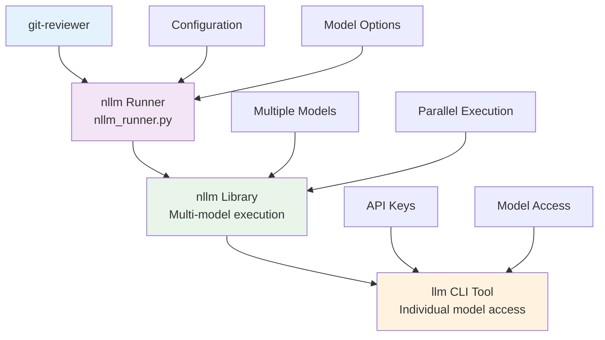
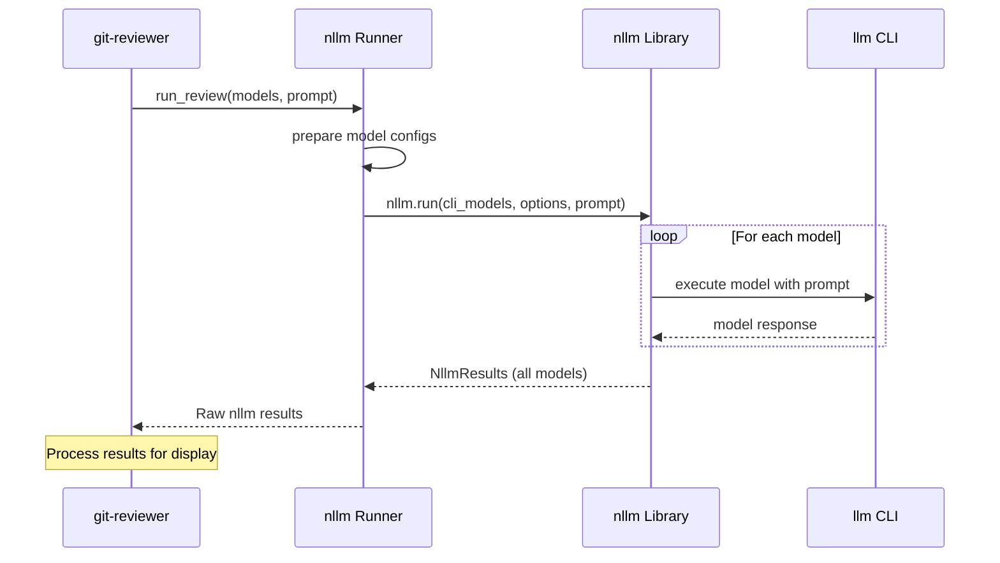

# AI Integration Design

## Overview

git-reviewer integrates with multiple AI models through the nllm library, which provides a unified interface for parallel model execution. This design enables simultaneous reviews from different models while maintaining simplicity and reliability.

## Integration Architecture



## nllm Integration

### Core Design Principles

1. **Simplicity**: Direct passthrough to nllm with minimal processing
2. **Transparency**: Return raw nllm results without modification
3. **Reliability**: Let nllm handle retries, timeouts, and error management
4. **Performance**: Leverage nllm's parallel execution capabilities

### NLLMRunner Implementation

The `NLLMRunner` class provides a thin wrapper around nllm:

```python
class NLLMRunner:
    def __init__(self, config: dict[str, Any]):
        self.config = config
        self.defaults = config.get("defaults", {})

    def run_review(self, models, prompt, output_dir=None):
        """Execute review using nllm Python API."""
        # Prepare models for nllm
        cli_models = [model["name"] for model in models]
        cli_model_options = []
        for model in models:
            cli_model_options.extend(self._prepare_model_options(model))

        # Execute via nllm and return raw results
        return nllm.run(
            cli_models=cli_models,
            cli_model_options=cli_model_options,
            outdir=str(output_dir) if output_dir else None,
            timeout=self.defaults.get("timeout"),
            retries=self.defaults.get("retries", 0),
            stream=False,  # Disable streaming for API usage
            quiet=True,    # Reduce console output
            llm_args=[prompt],
        )
```

## Model Configuration Format

### git-reviewer Model Config
```yaml
models:
  - name: gpt-4
    options: ["-o", "temperature", "0.1", "-o", "max_tokens", "4000"]
  - name: claude-3-sonnet
    options: ["--system", "You are a code reviewer"]
```

### Conversion to nllm Format

git-reviewer converts its model configuration to nllm's format:

```python
def _prepare_model_options(self, model_config):
    """Convert model options to nllm format."""
    model_name = model_config["name"]
    model_options = model_config.get("options", [])

    if not model_options:
        return []

    # Convert to nllm format: model:option1:option2:...
    option_str = f"{model_name}:" + ":".join(model_options)
    return [option_str]
```

**Example Conversion:**
```python
# git-reviewer config:
{
    "name": "gpt-4",
    "options": ["-o", "temperature", "0.1", "--system", "You are helpful"]
}

# Becomes nllm format:
"gpt-4:-o:temperature:0.1:--system:You are helpful"
```

## Execution Flow



### Model Preparation and Execution

```python
# 1. Extract model names
cli_models = ["gpt-4", "claude-3-sonnet"]

# 2. Convert model options
cli_model_options = [
    "gpt-4:-o:temperature:0.1",
    "claude-3-sonnet:--system:You are a code reviewer"
]

# 3. Execute via nllm
results = nllm.run(
    cli_models=cli_models,
    cli_model_options=cli_model_options,
    outdir="/tmp/reviews",
    retries=1,
    stream=False,
    quiet=True,
    llm_args=["Please review this code..."]
)
```

### Result Processing
git-reviewer returns the raw `nllm.NllmResults` object:

```python
# Raw nllm results structure
results = {
    results: [ModelResult, ...],  # Individual model results
    manifest: RunManifest,        # Execution metadata
    success_count: int,           # Number of successful models
    total_count: int,            # Total models executed
    exit_code: int               # Overall exit code
}
```

## Result Handling

### nllm Results Structure

Each `ModelResult` contains:

```python
@dataclass
class ModelResult:
    model: str                    # Model identifier
    status: Literal["ok", "error", "timeout"]  # Execution status
    duration_ms: int              # Execution time
    exit_code: int               # Process exit code
    text: str                    # Raw model output
    command: list[str]           # Command executed
    stderr_tail: str             # Error output (if any)
    json: dict | list | None     # Parsed JSON (if valid JSON response)
```

### JSON Parsing Integration

nllm automatically attempts to parse model responses as JSON:

```python
# In git-reviewer display logic
for result in nllm_results.results:
    if result.status == "ok":
        # Prefer nllm's parsed JSON if available
        if hasattr(result, 'json') and result.json is not None:
            # Use structured output
            summary = result.json.get('summary', {})
            display_summary(summary)
        else:
            # Fall back to raw text
            display_text(result.text)
```

## Error Handling

### Error Types and Handling

1. **Model Execution Errors**
   - Handled by nllm with automatic retries
   - Reported in `ModelResult.status` and `stderr_tail`
   - git-reviewer displays errors without modification

2. **Configuration Errors**
   - Invalid model names: Detected by nllm
   - Bad options: Passed through to llm for validation
   - Missing dependencies: Checked during initialization

3. **Timeout Handling**
   - Per-model timeouts configured in nllm
   - Failed models reported but don't block others
   - Partial results returned for successful models

### Error Flow Example

```python
# nllm handles individual model failures
results = nllm.run(...)

# git-reviewer processes all results, including failures
for result in results.results:
    if result.status == "error":
        print(f"Model {result.model} failed: {result.stderr_tail}")
    elif result.status == "timeout":
        print(f"Model {result.model} timed out after {result.duration_ms}ms")
    else:
        # Success case
        process_review(result)
```

## Model Management

### Model Discovery
git-reviewer relies on nllm/llm for model discovery:

```python
def check_nllm_available(self):
    """Check if nllm Python API is available."""
    try:
        import nllm
        return True, f"nllm Python API available (version: {nllm.__version__})"
    except ImportError:
        return False, "nllm Python API not available. Please install nllm package."
```

### Model Validation
```python
def validate_models(self, models):
    """Validate that models are properly configured."""
    issues = []
    for i, model in enumerate(models):
        if "name" not in model:
            issues.append(f"Model at index {i} missing 'name' field")

        model_name = model["name"]
        if not isinstance(model_name, str) or not model_name.strip():
            issues.append(f"Model at index {i} has invalid name: {model_name}")

        if "options" in model:
            options = model["options"]
            if not isinstance(options, list):
                issues.append(f"Model '{model_name}' options must be a list")
            elif not all(isinstance(opt, str) for opt in options):
                issues.append(f"Model '{model_name}' options must be strings")

    return issues
```

## Performance Optimizations

### Parallel Execution
- **Always Parallel**: All models execute simultaneously via nllm
- **No Serial Fallback**: Removed parallel configuration option
- **Optimal Resource Usage**: nllm manages concurrency automatically

### Resource Management
```python
# nllm configuration for optimal performance
nllm.run(
    cli_models=models,
    timeout=120,        # Per-model timeout
    retries=1,          # Automatic retries for transient failures
    stream=False,       # Disable streaming for batch processing
    quiet=True,         # Minimize console output
)
```

### Output Processing
- **Direct Access**: Return raw nllm results without processing
- **Lazy Parsing**: JSON parsing only when needed for display
- **Memory Efficient**: No intermediate result transformations

## Security Considerations

### API Key Management
- **Delegated**: git-reviewer doesn't handle API keys directly
- **llm Integration**: Keys managed by llm CLI tool
- **Environment**: Supports standard environment variable patterns

### Input Sanitization
- **Template Safety**: Review templates use safe variable substitution
- **Command Injection**: nllm handles command construction safely
- **Output Validation**: No execution of model-generated code

### Data Privacy
- **No Persistence**: Results stored only in user-specified directories
- **Temporary Files**: Cleaned up automatically by nllm
- **Local Processing**: All processing happens locally

## Integration Testing

### Validation Strategy
```python
# Test nllm integration without actual API calls
def test_nllm_integration():
    runner = NLLMRunner(test_config)

    # Mock nllm execution
    with patch('nllm.run') as mock_run:
        mock_run.return_value = create_mock_results()

        results = runner.run_review(test_models, test_prompt)

        # Verify nllm called with correct parameters
        mock_run.assert_called_once_with(
            cli_models=["test-model"],
            cli_model_options=["test-model:-o:temperature:0.1"],
            outdir=None,
                    retries=0,
            stream=False,
            quiet=True,
            llm_args=["test prompt"]
        )
```

## Future Enhancements

### Planned Improvements

1. **Streaming Support**: Real-time model output display
2. **Cost Tracking**: Integration with nllm cost tracking features
3. **Model Health**: Automatic model availability checking
4. **Custom Providers**: Support for custom model providers
5. **Result Caching**: Cache results for repeated reviews

### nllm Library Evolution

git-reviewer is designed to automatically benefit from nllm improvements:
- **New Models**: Automatic support as llm adds model support
- **Performance**: Inherits nllm optimizations
- **Features**: JSON parsing, result formatting, etc.
- **Reliability**: Error handling and retry improvements

The thin wrapper approach ensures git-reviewer remains simple while providing maximum flexibility and forward compatibility.