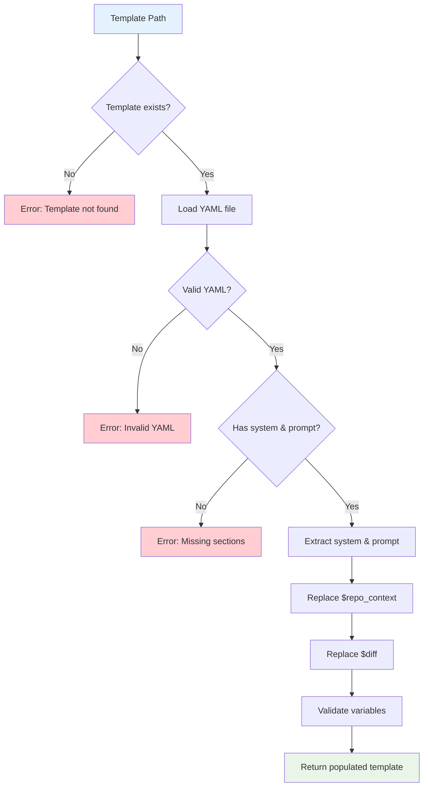

# Template System Design

## Overview

git-reviewer uses a YAML-based template system to generate structured prompts for AI models. The template system is designed for flexibility, allowing users to customize review criteria, output format, and prompting strategies while maintaining consistency across reviews.

## Template Structure

### YAML Format
Templates are stored as YAML files with two main sections:

```yaml
# review.template.yml
system: |
  System-level instructions that set the context and role for the AI model.
  This section defines the AI's persona, capabilities, and constraints.

prompt: |
  The main prompt template with variable placeholders.
  This section contains the detailed instructions, input descriptions,
  and output format specifications.
```

### Variable Substitution

Templates support variable substitution using simple string replacement:

- `$repo_context` - Repository context files and metadata
- `$diff` - Git diff content to be reviewed

## Default Template Analysis

### System Section
```yaml
system: |
  You are a **principal-level software engineer, performance, and security reviewer**
  performing a **blocking** review of all changes in a **feature branch** compared
  to its base (e.g., `main`). Your goal is to deliver an incisive, evidence-based
  review that is safe to ship, practical to act on, and formatted as **strict JSON**.
```

**Design Rationale:**
- **Role Definition**: Establishes expertise level and authority
- **Review Type**: Clarifies this is a blocking review (not advisory)
- **Output Format**: Specifies strict JSON requirement upfront
- **Quality Focus**: Emphasizes evidence-based and actionable feedback

### Prompt Structure

The default prompt follows a comprehensive structure:

#### 1. Mindset & Principles
```yaml
prompt: |
  **Mindset**
  - **Safety first**: correctness & security > performance > ergonomics > style.
  - **Skeptical & precise**: treat inputs as adversarial; anchor every finding to concrete evidence.
  - **Actionable**: every finding must include why it matters and a minimal concrete fix.
  - **No chain-of-thought**: output conclusions and rationale only.
```

#### 2. Input Description
```yaml
  ## Inputs You Will Receive
  - **Diff**: unified git diff with file paths and line numbers
  - **Repository context (optional)**: key files, architecture notes, config
```

#### 3. Review Checklist
Comprehensive categories covering:
- **Security**: Injection, XSS, auth, crypto, secrets
- **Correctness**: Input validation, error handling, API contracts
- **Performance**: Scalability, N+1 queries, memory usage
- **Reliability**: Concurrency, timeouts, graceful degradation
- **Testing**: Coverage, test quality, edge cases
- **Maintainability**: Code quality, documentation

#### 4. Review Methodology
```yaml
  ## Review Technique (How to Think)
  1. Derive the **intended behavior** from branch/PR description
  2. Triage **high-risk surfaces** first
  3. Do **taint-style reasoning** from untrusted inputs to sinks
  4. Trace **error paths** and side-effect **state transitions**
  5. Prefer **minimal local fixes**
```

#### 5. Output Schema
Detailed JSON schema with specific fields:
- **summary**: Overall assessment and recommendation
- **blocking_issues**: Critical problems that must be fixed
- **findings**: Non-blocking issues with severity levels
- **explanation**: **NEW** - Exhaustive documentation of every change in the diff
- **security_review**: Security-specific analysis
- **performance_notes**: Performance considerations
- **testing_gaps**: Missing test coverage
- **risk_assessment**: Impact and likelihood analysis

## Template Processing



### Loading and Validation

```python
def populate_template(template_path, repo_context, diff_content):
    """Load and populate a review template."""
    # Load YAML template
    with open(template_path) as f:
        template_data = yaml.safe_load(f)

    # Validate structure
    if not isinstance(template_data, dict):
        raise ValueError("Template must be a dictionary")
    if "system" not in template_data or "prompt" not in template_data:
        raise ValueError("Template must have 'system' and 'prompt' sections")

    # Perform variable substitution
    system = template_data["system"]
    prompt = template_data["prompt"]

    # Replace variables
    populated_prompt = prompt.replace("$repo_context", repo_context)
    populated_prompt = populated_prompt.replace("$diff", diff_content)

    return {
        "system": system,
        "prompt": populated_prompt
    }
```

### Variable Processing

#### Repository Context Variable (`$repo_context`)
```python
def build_repo_context(context_files, repo_path):
    """Build repository context from files."""
    if not context_files:
        return "(No additional context provided)"

    context_parts = []
    for file_path in context_files:
        try:
            with open(repo_path / file_path, 'r') as f:
                content = f.read()
            context_parts.append(f"File: {file_path}\n---\n{content}\n---\n")
        except Exception as e:
            context_parts.append(f"File: {file_path}\n[Error reading file: {e}]\n")

    return "\n".join(context_parts)
```

#### Diff Variable (`$diff`)
The diff content comes directly from git operations with configurable context lines and scope.

### nllm Integration

The populated template is converted to nllm's expected format:

```python
def format_prompt_for_nllm(populated_template):
    """Format the populated template for nllm execution."""
    system_prompt = populated_template["system"].strip()
    user_prompt = populated_template["prompt"].strip()

    # Combine system and user prompts
    full_prompt = f"{system_prompt}\n\n{user_prompt}"

    return full_prompt
```

## Output Schema Design

### JSON Structure Requirements

The default template enforces a specific JSON schema designed for structured analysis:

```json
{
  "summary": {
    "readiness": "approve|approve_with_nits|request_changes",
    "risk_level": "low|medium|high",
    "overall_risk_score": 0,
    "overview": "Summary description",
    "recommendation": "Action to take"
  },
  "blocking_issues": [...],
  "findings": [...],
  "explanation": {
    "overview": "Comprehensive summary of all changes",
    "detailed_analysis": [...],
    "architectural_impact": "System-wide effects",
    "data_flow_changes": "How data flows differently",
    "integration_points": "Affected external systems",
    "behavioral_changes": "Changes in behavior",
    "rollback_considerations": "Rollback requirements"
  },
  "security_review": {...},
  "performance_notes": [...],
  "testing_gaps": [...],
  "risk_assessment": {...}
}
```

### Schema Benefits

1. **Structured Analysis**: Forces comprehensive review coverage
2. **Consistent Format**: Enables automated processing and comparison
3. **Severity Classification**: Clear distinction between blocking and non-blocking issues
4. **Actionable Output**: Every finding includes specific remediation steps
5. **Risk Assessment**: Quantified risk evaluation for decision making
6. **Exhaustive Documentation**: Complete explanation of all changes for audit trails and knowledge transfer

### Display Integration

git-reviewer's CLI looks for structured output:

```python
def display_nllm_results(nllm_results, verbose=False):
    for result in nllm_results.results:
        if result.status == "ok":
            # Prefer nllm's parsed JSON if available
            if hasattr(result, 'json') and result.json is not None:
                # Extract summary from structured output
                if 'summary' in result.json:
                    summary_output = json.dumps(result.json['summary'], indent=2)
                    console.print(Panel(summary_output, border_style="green"))
```

## Template Customization

### Custom Template Creation

Users can create custom templates by following the same structure:

```yaml
# custom-security-review.template.yml
system: |
  You are a security specialist conducting a focused security review.
  Prioritize finding vulnerabilities and security misconfigurations.

prompt: |
  Focus specifically on security aspects of the following code changes:

  ## Security Review Checklist
  - Input validation and sanitization
  - Authentication and authorization
  - Data exposure and privacy
  - Cryptographic implementations

  Repository context:
  ---
  $repo_context
  ---

  Code changes to review:
  ---
  $diff
  ---

  Output a JSON object with security-specific findings...
```

### Template Selection

Templates can be specified via configuration:

```yaml
# Configuration
paths:
  template: custom-security-review.template.yml
```

Or via CLI:
```bash
git-reviewer review --template-path ./custom-template.yml
```

## Template Resolution

### Resolution Order

1. **CLI Argument**: `--template-path` parameter
2. **Configuration**: `paths.template` setting
3. **Default**: Built-in `review.template.yml`

### Path Resolution Logic

```python
def resolve_template_path(config, template_override=None):
    """Resolve template path with fallback logic."""
    if template_override:
        # CLI override - use as-is
        return Path(template_override)

    # Get from configuration
    template_path = Path(config["paths"]["template"])

    if template_path.is_absolute():
        return template_path

    # Try relative to repository
    if (Path.cwd() / template_path).exists():
        return Path.cwd() / template_path

    # Try relative to git-reviewer package
    import git_reviewer
    package_dir = Path(git_reviewer.__file__).parent
    package_template = package_dir / template_path

    if package_template.exists():
        return package_template

    raise FileNotFoundError(f"Template not found: {template_path}")
```

## Advanced Template Features

### Conditional Sections

Future enhancement for conditional template sections:

```yaml
# Advanced template with conditions
system: |
  You are a code reviewer with expertise in {{ language }}.

prompt: |
  Review the following {{ change_type }} changes:

  
  Pay special attention to security implications.
  

  
  Focus on performance and scalability concerns.
  
```

### Template Inheritance

Planned feature for template inheritance:

```yaml
# base-review.template.yml
extends: null
system: |
  Base system prompt...

# security-review.template.yml
extends: base-review.template.yml
system: |
  {{ parent.system }}
  Additionally, you are a security specialist...
```

### Variable Expansion

Enhanced variable support:

```yaml
prompt: |
  Repository: {{ repo.name }}
  Branch: {{ git.current_branch }}
  Author: {{ git.author }}
  Files changed: {{ diff.files_count }}

  Context files:
  
  - {{ file.path }} ({{ file.size_kb }}KB)
  
```

## Error Handling

### Template Validation

```python
def validate_template(template_data):
    """Validate template structure and content."""
    if not isinstance(template_data, dict):
        raise TemplateError("Template must be a YAML object")

    required_fields = ["system", "prompt"]
    for field in required_fields:
        if field not in template_data:
            raise TemplateError(f"Template missing required field: {field}")
        if not isinstance(template_data[field], str):
            raise TemplateError(f"Template field '{field}' must be a string")
```

### Variable Substitution Errors

```python
def safe_variable_substitution(template, variables):
    """Perform safe variable substitution with error handling."""
    result = template
    for var_name, var_value in variables.items():
        placeholder = f"${var_name}"
        if placeholder in result:
            result = result.replace(placeholder, str(var_value))

    # Check for unresolved variables
    import re
    unresolved = re.findall(r'\$\w+', result)
    if unresolved:
        logger.warning(f"Unresolved template variables: {unresolved}")

    return result
```

## Best Practices

### Template Design Guidelines

1. **Clear Instructions**: Specific, actionable prompts
2. **Structured Output**: Enforce consistent JSON schema
3. **Evidence-Based**: Require concrete evidence for findings
4. **Severity Levels**: Use consistent severity classifications
5. **Minimal Fixes**: Request specific, minimal remediation steps

### Performance Considerations

1. **Template Size**: Keep templates reasonably sized for token limits
2. **Context Efficiency**: Include only necessary context
3. **Output Parsing**: Design for efficient JSON parsing
4. **Model Compatibility**: Test templates with target models

### Maintenance

1. **Version Control**: Track template changes
2. **Testing**: Validate templates with sample diffs
3. **Documentation**: Document custom template schemas
4. **Backwards Compatibility**: Maintain schema compatibility

The template system provides the foundation for customizable, structured AI-powered code reviews while maintaining consistency and quality across different review scenarios.