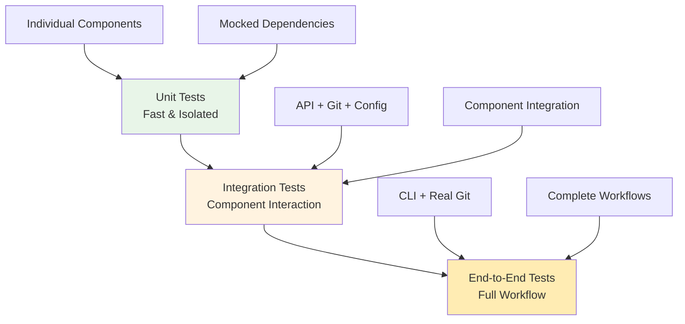
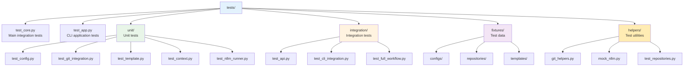

# Testing Strategy

## Overview

git-reviewer employs a comprehensive testing strategy that covers unit testing, integration testing, and end-to-end scenarios. The testing approach focuses on reliability, maintainability, and ensuring correct behavior across different git repository states and AI model configurations.

## Testing Architecture



## Test Structure

### Test Organization



## Unit Testing

### Component-Level Testing

#### Configuration System Tests
```python
# tests/unit/test_config.py
class TestConfigurationSystem:
    def test_load_default_config(self):
        """Test loading default configuration."""
        config = get_default_config()
        assert config["defaults"]["timeout"] == 120
        assert config["git"]["base_branch"] == "main"

    def test_config_merge(self):
        """Test configuration merging hierarchy."""
        base = {"defaults": {"timeout": 120, "retries": 1}}
        override = {"defaults": {"timeout": 300}}

        result = deep_merge_config(base, override)
        assert result["defaults"]["timeout"] == 300
        assert result["defaults"]["retries"] == 1

    def test_config_validation(self):
        """Test configuration validation."""
        invalid_config = {"models": [{"name": ""}]}  # Empty name
        with pytest.raises(ConfigurationError):
            validate_config(invalid_config)
```

#### Git Integration Tests
```python
# tests/unit/test_git_integration.py
class TestGitIntegration:
    def test_validate_git_repo(self, tmp_git_repo):
        """Test git repository validation."""
        # Valid repository
        validate_git_repo(tmp_git_repo)

        # Invalid repository
        with pytest.raises(GitRepositoryError):
            validate_git_repo(Path("/tmp/not-a-repo"))

    def test_diff_generation(self, tmp_git_repo):
        """Test diff generation with different scopes."""
        # Create test changes
        create_test_changes(tmp_git_repo)

        # Test committed changes only
        diff = generate_diff(tmp_git_repo, "main", 3, "committed")
        assert "test_file.py" in diff

        # Test all changes
        diff_all = generate_diff(tmp_git_repo, "main", 3, "all")
        assert len(diff_all) >= len(diff)

    @pytest.mark.parametrize("context_lines", [1, 3, 5])
    def test_context_lines(self, tmp_git_repo, context_lines):
        """Test different context line configurations."""
        create_test_changes(tmp_git_repo)
        diff = generate_diff(tmp_git_repo, "main", context_lines, "all")
        # Verify context lines are respected
        assert f"@@" in diff  # Unified diff format
```

#### Template System Tests
```python
# tests/unit/test_template.py
class TestTemplateSystem:
    def test_template_loading(self, sample_template):
        """Test template loading and validation."""
        template_data = load_template(sample_template)
        assert "system" in template_data
        assert "prompt" in template_data

    def test_variable_substitution(self):
        """Test template variable substitution."""
        template = "Context: $repo_context\nDiff: $diff"
        populated = substitute_variables(
            template,
            {"repo_context": "Test context", "diff": "Test diff"}
        )
        assert "Test context" in populated
        assert "Test diff" in populated
        assert "$" not in populated

    def test_invalid_template(self):
        """Test handling of invalid templates."""
        with pytest.raises(TemplateError):
            validate_template({})  # Missing required fields

        with pytest.raises(TemplateError):
            validate_template({"system": 123})  # Wrong type
```

### Mocking Strategy

#### nllm Integration Mocking
```python
# tests/helpers/mock_nllm.py
class MockNllmResults:
    def __init__(self, results=None, manifest=None):
        self.results = results or []
        self.manifest = manifest or MockManifest()
        self.success_count = len([r for r in self.results if r.status == "ok"])
        self.total_count = len(self.results)
        self.exit_code = 0 if self.success_count > 0 else 1

class MockModelResult:
    def __init__(self, model, status="ok", text="", json_data=None):
        self.model = model
        self.status = status
        self.text = text
        self.json = json_data
        self.duration_ms = 1000
        self.exit_code = 0 if status == "ok" else 1
        self.command = ["llm", "-m", model]
        self.stderr_tail = ""

@pytest.fixture
def mock_nllm_success():
    """Mock successful nllm execution."""
    results = [
        MockModelResult("gpt-4", "ok", "Test review output", {"summary": {"readiness": "approve"}}),
        MockModelResult("claude-3-sonnet", "ok", "Another review", {"summary": {"readiness": "approve_with_nits"}})
    ]
    return MockNllmResults(results)

@pytest.fixture
def mock_nllm_partial_failure():
    """Mock nllm execution with some failures."""
    results = [
        MockModelResult("gpt-4", "ok", "Success"),
        MockModelResult("claude-3-sonnet", "error", "", None)
    ]
    return MockNllmResults(results)
```

## Integration Testing

### API Integration Tests
```python
# tests/integration/test_api.py
class TestAPIIntegration:
    def test_review_repository_basic(self, tmp_git_repo, mock_nllm_success):
        """Test basic repository review via API."""
        with patch('git_reviewer.nllm_runner.nllm.run', return_value=mock_nllm_success):
            results = review_repository(
                repo_path=str(tmp_git_repo),
                models=["gpt-4"]
            )

        assert hasattr(results, 'results')
        assert len(results.results) > 0
        assert results.results[0].model == "gpt-4"

    def test_review_with_context_files(self, tmp_git_repo_with_context, mock_nllm_success):
        """Test review with additional context files."""
        context_files = ["src/main.py", "README.md"]

        with patch('git_reviewer.nllm_runner.nllm.run', return_value=mock_nllm_success):
            results = review_repository(
                repo_path=str(tmp_git_repo_with_context),
                models=["gpt-4"],
                context_files=context_files
            )

        # Verify context was included
        assert results is not None

    def test_configuration_override(self, tmp_git_repo, mock_nllm_success):
        """Test API with configuration overrides."""
        config_override = {
            "git": {"base_branch": "develop"},
            "defaults": {"timeout": 300}
        }

        with patch('git_reviewer.nllm_runner.nllm.run', return_value=mock_nllm_success) as mock_run:
            review_repository(
                repo_path=str(tmp_git_repo),
                models=["gpt-4"],
                config_override=config_override
            )

        # Verify timeout was passed correctly
        call_kwargs = mock_run.call_args.kwargs
        assert call_kwargs["timeout"] == 300
```

### CLI Integration Tests
```python
# tests/integration/test_cli_integration.py
class TestCLIIntegration:
    def test_review_command_basic(self, runner, tmp_git_repo, mock_nllm_success):
        """Test basic review command."""
        with patch('git_reviewer.nllm_runner.nllm.run', return_value=mock_nllm_success):
            result = runner.invoke(
                app, ["review", str(tmp_git_repo), "--model", "gpt-4"]
            )

        assert result.exit_code == 0
        assert "✓ 1 models completed successfully" in result.output

    def test_init_config_command(self, runner, tmp_path):
        """Test configuration initialization."""
        with patch('git_reviewer.config.get_global_config_path', return_value=tmp_path / "config.yaml"):
            result = runner.invoke(app, ["init-config"])

        assert result.exit_code == 0
        assert "Configuration initialized" in result.output
        assert (tmp_path / "config.yaml").exists()

    def test_check_command(self, runner, tmp_git_repo):
        """Test configuration check command."""
        result = runner.invoke(app, ["check"])

        assert result.exit_code == 0
        assert "git-reviewer" in result.output

    def test_verbose_output(self, runner, tmp_git_repo, mock_nllm_success):
        """Test verbose output mode."""
        with patch('git_reviewer.nllm_runner.nllm.run', return_value=mock_nllm_success):
            result = runner.invoke(
                app, ["review", str(tmp_git_repo), "--model", "gpt-4", "--verbose"]
            )

        assert result.exit_code == 0
        assert "Generated diff with" in result.output
```

## End-to-End Testing

### Full Workflow Tests
```python
# tests/integration/test_full_workflow.py
class TestFullWorkflow:
    def test_complete_review_workflow(self, real_git_repo, mock_nllm_success):
        """Test complete review workflow from CLI to results."""
        # This test uses a real git repository with actual changes

        with patch('git_reviewer.nllm_runner.nllm.run', return_value=mock_nllm_success):
            # Test via CLI
            runner = CliRunner()
            result = runner.invoke(app, [
                "review",
                str(real_git_repo),
                "--model", "gpt-4",
                "--context-file", "src/main.py",
                "--base-branch", "main",
                "--verbose"
            ])

        # Verify successful execution
        assert result.exit_code == 0

        # Verify output contains expected elements
        assert "✓" in result.output  # Success indicator
        assert "gpt-4" in result.output  # Model name
        assert "Full results saved to" in result.output  # Output location

    def test_error_handling_workflow(self, invalid_git_repo):
        """Test error handling in complete workflow."""
        runner = CliRunner()
        result = runner.invoke(app, ["review", str(invalid_git_repo)])

        assert result.exit_code == 1
        assert "Error:" in result.output
```

## Test Fixtures and Utilities

### Git Repository Fixtures
```python
# tests/helpers/git_helpers.py
@pytest.fixture
def tmp_git_repo(tmp_path):
    """Create a temporary git repository with test content."""
    repo_path = tmp_path / "test_repo"
    repo_path.mkdir()

    # Initialize git repository
    subprocess.run(["git", "init"], cwd=repo_path, check=True)
    subprocess.run(["git", "config", "user.email", "test@example.com"], cwd=repo_path)
    subprocess.run(["git", "config", "user.name", "Test User"], cwd=repo_path)

    # Create initial commit
    (repo_path / "README.md").write_text("# Test Repository")
    subprocess.run(["git", "add", "README.md"], cwd=repo_path)
    subprocess.run(["git", "commit", "-m", "Initial commit"], cwd=repo_path)

    # Create main branch
    subprocess.run(["git", "branch", "-M", "main"], cwd=repo_path)

    return repo_path

def create_test_changes(repo_path):
    """Create test changes in the repository."""
    # Create a new file
    test_file = repo_path / "test_file.py"
    test_file.write_text("""
def hello_world():
    print("Hello, World!")
    return True

def add_numbers(a, b):
    return a + b
""")

    # Stage and commit
    subprocess.run(["git", "add", "test_file.py"], cwd=repo_path)
    subprocess.run(["git", "commit", "-m", "Add test functions"], cwd=repo_path)

    # Create additional unstaged changes
    test_file.write_text(test_file.read_text() + """
def multiply_numbers(a, b):
    return a * b
""")
```

### Configuration Fixtures
```python
# Test configuration fixtures
@pytest.fixture
def test_config():
    """Provide test configuration."""
    return {
        "models": [
            {"name": "gpt-4", "options": ["-o", "temperature", "0.1"]},
            {"name": "claude-3-sonnet", "options": []}
        ],
        "defaults": {
            "timeout": 120,
            "retries": 1
        },
        "git": {
            "base_branch": "main",
            "context_lines": 3,
            "diff_scope": "all"
        },
        "paths": {
            "template": "review.template.yml"
        }
    }

@pytest.fixture
def sample_template(tmp_path):
    """Create a sample template for testing."""
    template_content = """
system: |
  You are a test code reviewer.

prompt: |
  Review the following changes:

  Context: $repo_context

  Diff: $diff
"""
    template_path = tmp_path / "test_template.yml"
    template_path.write_text(template_content)
    return template_path
```

## Testing Patterns

### Test Isolation
```python
class TestIsolation:
    def setup_method(self):
        """Set up clean state for each test."""
        self.temp_dirs = []
        self.original_cwd = os.getcwd()

    def teardown_method(self):
        """Clean up after each test."""
        os.chdir(self.original_cwd)
        for temp_dir in self.temp_dirs:
            if temp_dir.exists():
                shutil.rmtree(temp_dir)
```

### Parameterized Testing
```python
@pytest.mark.parametrize("model,expected_status", [
    ("gpt-4", "ok"),
    ("claude-3-sonnet", "ok"),
    ("invalid-model", "error")
])
def test_model_execution(model, expected_status, mock_nllm):
    """Test execution with different models."""
    # Test logic here
    pass

@pytest.mark.parametrize("diff_scope", ["all", "committed"])
def test_diff_scopes(tmp_git_repo, diff_scope):
    """Test different diff scope configurations."""
    create_test_changes(tmp_git_repo)
    diff = generate_diff(tmp_git_repo, "main", 3, diff_scope)
    assert diff  # Should generate some diff content
```

## Performance Testing

### Load Testing
```python
class TestPerformance:
    def test_large_repository_handling(self, large_git_repo):
        """Test handling of repositories with many files."""
        start_time = time.time()

        # Mock to avoid actual AI calls
        with patch('git_reviewer.nllm_runner.nllm.run'):
            result = review_repository(str(large_git_repo))

        duration = time.time() - start_time
        assert duration < 30  # Should complete within 30 seconds

    def test_memory_usage(self, tmp_git_repo):
        """Test memory usage doesn't grow excessively."""
        import tracemalloc
        tracemalloc.start()

        with patch('git_reviewer.nllm_runner.nllm.run'):
            review_repository(str(tmp_git_repo))

        current, peak = tracemalloc.get_traced_memory()
        tracemalloc.stop()

        # Memory usage should be reasonable (< 100MB)
        assert peak < 100 * 1024 * 1024
```

## Continuous Integration

### Test Execution Strategy
```yaml
# .github/workflows/test.yml
name: Tests
on: [push, pull_request]

jobs:
  test:
    runs-on: ubuntu-latest
    strategy:
      matrix:
        python-version: ["3.12", "3.13"]

    steps:
      - uses: actions/checkout@v4
      - uses: actions/setup-python@v4
        with:
          python-version: ${{ matrix.python-version }}

      - name: Install dependencies
        run: |
          pip install -e .[test]

      - name: Run unit tests
        run: pytest tests/unit/ -v --cov=git_reviewer

      - name: Run integration tests
        run: pytest tests/integration/ -v

      - name: Run full test suite
        run: pytest --cov=git_reviewer --cov-report=xml

      - name: Upload coverage
        uses: codecov/codecov-action@v3
```

## Test Coverage Goals

### Coverage Targets
- **Unit Tests**: 95%+ coverage of individual components
- **Integration Tests**: 85%+ coverage of component interactions
- **E2E Tests**: 100% coverage of primary user workflows

### Coverage Exclusions
```python
# .coveragerc
[run]
omit =
    tests/*
    */venv/*
    setup.py

[report]
exclude_lines =
    pragma: no cover
    def __repr__
    raise AssertionError
    raise NotImplementedError
```

The testing strategy ensures git-reviewer is reliable, maintainable, and behaves correctly across diverse repository configurations and usage scenarios.